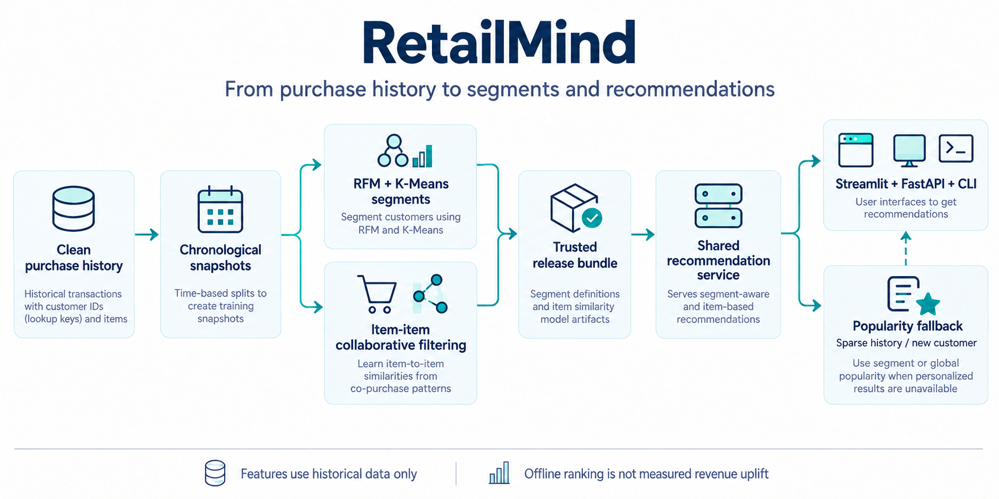

# RetailMind

**Turn purchase history into customer segments and product recommendations.**

[](https://github.com/luqshzeeq3601-art/05_RetailMind_Customer_Segmentation_Recommender/actions/workflows/ci.yml)
[](LICENSE)

RetailMind builds historical RFM snapshots, groups customers with K-Means and ranks products with item-item collaborative filtering. A shared service powers Streamlit, FastAPI and the CLI, with explicit segment/global-popularity fallback for sparse history and new customers.

## 1. Workflow



Customer IDs are lookup keys, not model features. Features/catalogues use the allowed historical prefix; future transactions are reserved for evaluation. Fallback status remains visible to the caller.

## 2. Measured results

UK UCI Online Retail benchmark, with recommendations evaluated against a subsequent 28-day purchase window.

| Capability | Frozen result |
| --- | --- |
| Segmentation | K-Means, K=3; silhouette **0.3667** |
| Recommendation NDCG@10 | **0.1698** vs segment popularity 0.1232 |
| Paired 95% bootstrap interval for the NDCG difference | **[0.0349, 0.0585]** |
| Hit Rate@10 | **58.54%** |
| Recall@10 | **0.0788** |
| Active-catalog coverage | **32.0%** of 2,753 items |

Evidence: [test metrics](reports/test_metrics.json), [segmentation comparison](reports/cluster_comparison.csv), [evaluation](reports/evaluation.md), [model card](docs/MODEL_CARD.md). These are offline ranking/segmentation results; revenue, margin and campaign uplift were not measured.

## 3. Quick start

Use Python 3.11. Clone/download the same branch or revision as this README, then run from the repository root. The verified updates are currently in [draft PR 1](https://github.com/luqshzeeq3601-art/05_RetailMind_Customer_Segmentation_Recommender/pull/1) on `fix/portfolio-remediation`.

```sh
python -m venv .venv
```

Activate with `.\.venv\Scripts\Activate.ps1` in Windows PowerShell, or `source .venv/bin/activate` on Linux/macOS.

```sh
python -m pip install -r requirements-dev.txt
python -m pip install --no-deps -e .
```

The trusted release bundle is included in `artifacts/release`; retraining is not required to try the dashboard.

### Open the dashboard

```sh
python -m streamlit run app/dashboard.py
```

Use the built-in benchmark demo selector or a customer lookup. `17850` is a documented benchmark customer; `DEMO-NEW-999` demonstrates cold-start fallback. Try recommendations, CSV export and the model-card/evidence tab. [Demo IDs](tests/fixtures/demo_customers.json).

### Use the CLI or API

```sh
python -m retailmind.cli recommend --customer-id 17850 --top-k 10 --bundle artifacts/release
python -m uvicorn retailmind.api:app --host 127.0.0.1 --port 8000
```

Open [local API docs](http://127.0.0.1:8000/docs) for request/response schemas. See [technical design](docs/04_TECHNICAL_DESIGN.md) for the shared service and fallback contract.

### Run the dashboard image

In Bash, from the repository root:

```sh
docker build -t retailmind:local .
docker run --rm -p 127.0.0.1:8501:8501 --mount "type=bind,source=$(pwd)/artifacts/release,target=/app/artifacts/release,readonly" retailmind:local
```

On PowerShell, use `(Resolve-Path artifacts/release).Path` as the absolute bind-mount source. The code-only image includes the approved aggregate evaluation report, while the trusted release bundle is mounted read-only.

## 4. Verification

```sh
python -m pytest -q -p no:cacheprovider --basetemp .pytest_tmp
python -m ruff check .
```

For the separate browser check, start the dashboard on port 8501, then run:

```sh
python -m playwright install chromium
python tests/verify_browser.py
```

CI runs package tests, builds the image, mounts the release read-only and checks desktop/mobile browser flows. [Verification matrix](reports/validation.md) · [Recorded desktop view](reports/screenshots/desktop_customer_view.png).

## 5. Limitations and delivery

- Clusters describe purchase patterns; their IDs have no natural order and do not prove campaign effects.
- Item similarities are not calibrated purchase probabilities. Cold-start and sparse-history cases use explicit fallback.
- Data comes from a UK retailer; performance in other catalogues/markets remains unverified.
- **Public dashboard access remains unverified.** The advertised Streamlit service must pass a fresh-browser access and recommendation check before the delivery task closes.

## 6. Documentation and contributions

[Start here](docs/00_START_HERE.md) · [Data rules](docs/05_DATA_SPEC.md) · [Experiment plan](docs/06_EXPERIMENT_PLAN.md) · [Tasks](tasks/todo.md) · [Progress](docs/09_PROGRESS_LOG.md) · [Sources](docs/12_SOURCES.md) · [Diagram notes and prompt](docs/assets/workflow.md)

Follow [AGENTS.md](AGENTS.md). Preserve chronological splits, the frozen baseline and cohort accounting; include relevant tests for behavior changes.

## 7. License and data

Code/documentation use the [MIT license](LICENSE). UCI Online Retail has its own attribution and source terms. Raw customer transactions are acquired separately; public demos use the benchmark release and documented lookup examples.
