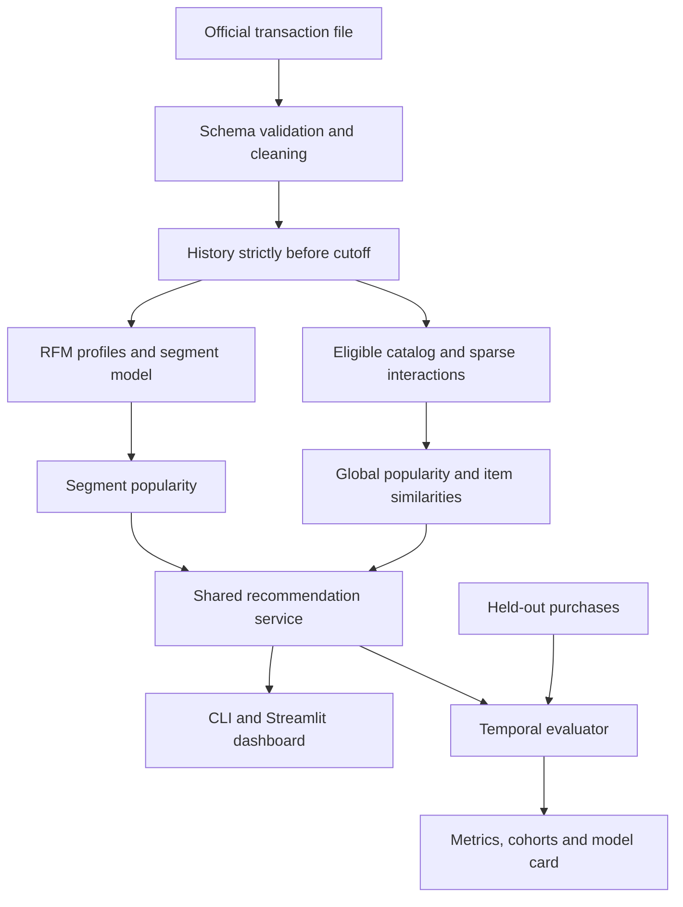

# 04. Technical Design

## 1. Architecture



Held-out purchases enter the evaluator only. They never enter the service bundle, transformations or model selection for that holdout.

## 2. Proposed stack

| Area | Choice | Reason |
|---|---|---|
| Runtime | Python 3.11 or 3.12, verified and locked in T01 | Fits local Windows workflows and the numerical stack |
| Data | pandas, NumPy, openpyxl for reading the source XLSX, PyArrow | Tabular processing and reproducible Parquet outputs |
| Models | scikit-learn | RFM transformations, K-Means, GMM and diagnostics |
| Recommendations | SciPy sparse matrices and sklearn cosine similarity | Small, understandable implicit-feedback baseline |
| Config / contracts | PyYAML and Pydantic | Explicit settings and validated output types |
| Interface | Streamlit and Plotly | Analyst workflow and inspectable charts |
| Tracking | Local MLflow with a local SQLite store | Record experiment parameters and artifacts without a hosted service |
| Verification | pytest and Ruff | Behavior tests and consistent Python checks |
| Packaging | Docker and GitHub Actions configuration | Portable local demo and repeatable checks |

Runtime is locked on **Python 3.11.9**. Compatible dependencies are pinned in `requirements.txt` and `requirements-dev.txt`, and locked in `requirements.lock` (`E5F4A06797B034CD6F6C02787A831BD4241DD91DC68A371D8F842DF44BEEADF9`). `pyproject.toml` defines package metadata.

## 3. Implemented repository layout

All pipeline modules, tests, dashboards, and artifacts are fully implemented and structured as follows:

```text
app/dashboard.py
configs/default.yaml
data/raw/                       # immutable downloaded source; ignored by Git
data/processed/                 # deterministic cleaned tables and snapshots
src/retailmind/
    cli.py                      # download, prepare, train, evaluate, freeze, recommend, monitor, benchmark
    contracts.py                # validated config and response types
    data.py                     # acquisition, schema and cleaning
    features.py                 # RFM and history snapshots
    segmentation.py             # rules, K-Means, GMM and segment profiles
    recommenders.py              # popularity and sparse item CF
    service.py                  # shared bundle loading and recommendations
    evaluation.py               # cohorts, ranking metrics and bootstrap intervals
    experiments.py              # training, tracking and freeze protocol
    monitoring.py               # reference/current diagnostic report
tests/fixtures/                 # small synthetic transactions and expected outcomes
tests/                          # unit and integration tests
artifacts/validation/            # validation-stage bundle
artifacts/test/                  # frozen-choice refit at test cutoff
artifacts/release/               # verified copy of test bundle; no latest-data refit in MVP
reports/                        # data audit, experiments, evaluation and validation
notebooks/                      # optional exploration; not runtime dependencies
docs/                           # implementation contract and evidence guidance
tasks/                          # plan and sole task-status checklist
```

Keep raw data, virtual environments, tracking databases and machine-specific caches outside the public source package. A Git ignore file must cover them when T01 creates it.

## 4. Module interfaces

| Interface | Inputs | Outputs / guarantees |
|---|---|---|
| `clean_transactions` | Raw table and frozen cleaning config | Eligible purchases plus an audit with exclusion reasons |
| `build_snapshot` | Eligible history, exclusive cutoff, 180-day RFM window | Profiles, known/inactive status, catalog and sparse interactions, all time-safe |
| `fit_segments` | Active RFM profiles and algorithm settings | Fitted transformer/model and versioned segment profiles |
| `fit_recommenders` | Snapshot interactions, catalog and segment assignments | Popularity rankings and bounded item neighbors |
| `recommend` | Trusted bundle, customer ID, K, mode | Validated response with deterministic ranks and explicit fallback |
| `evaluate_rankings` | Frozen bundle, holdout purchases and mode | Per-customer metrics, macro metrics, counts, coverage and exclusions |

Use pure functions for cleaning, features and metrics where possible. Avoid filesystem reads, UI state and mutable globals inside these functions. Unit tests should call them directly.

## 5. Shared recommendation contract

### 5.1 Request

- `customer_id`: nonempty trimmed string, at most 64 characters. IDs are lookup values, never filesystem paths.
- `top_k`: integer 1–20; default 10. Reject 0, negatives, booleans and values above 20.
- `mode`: `repeat_allowed` or `new_items_only`.
- `bundle`: an explicit trusted local directory with a manifest. No remote URL or uploaded model file.

### 5.2 Customer status and segment

| Status | Meaning | Segment |
|---|---|---|
| `known_active` | At least one eligible purchase in the 180-day RFM window | Learned segment or RFM-rule segment |
| `known_inactive` | Eligible purchase history exists, but none in that window | `inactive_recent_window` |
| `unknown_customer` | ID absent from all eligible history before cutoff | Null; global popularity fallback |

An inactive customer can still have history for collaborative filtering. Customer status and recommendation fallback are different fields.

### 5.3 Recommendation response

Required top-level fields: `customer_id`, `customer_status`, nullable `segment_id` and `segment_label`, `snapshot_cutoff`, `recommendation_mode`, `requested_k`, `returned_k`, `status`, `fallback_count`, `model_version`, `items`.

Each item contains `rank`, `stock_code`, `description`, finite `score`, `method`, `reason_code`, `reason_text`, `supporting_stock_codes`, `is_fallback`.

- Methods: `item_cf`, `segment_popularity`, `global_popularity`.
- Reasons: `similar_to_purchase_history`, `popular_in_segment`, `popular_overall`.
- Scores are specific to their method. Fill fallback positions after personalized positions; do not sort mixed methods by incomparable scores.
- Similarity explanations cite up to 3 historical products contributing to the item score. They describe association, not causation.
- Product descriptions must come from history before cutoff. If absent, display the stock code.
- Break equal scores by canonical StockCode ascending.

### 5.4 Response status precedence

1. `empty_catalog`: zero candidates after the mode filter.
2. `insufficient_catalog`: fewer than requested K candidates.
3. `fallback_only`: enough candidates exist, but all results use popularity.
4. `ok`: requested K returned and at least one personalized result.

The returned list may be shorter than K. Never invent items. In `new_items_only`, remove **all** products bought by this customer before cutoff from every method and fallback list.

### 5.5 CSV exports

- Recommendations: one row per item, with all item fields plus customer ID, status, cutoff, mode, model version and fallback count. Encode supporting stock codes as a JSON array string.
- Segments: segment ID, label, customer count, customer share, median recency/frequency/monetary, campaign hypothesis, cutoff and version.
- Generate exports from the same response used by the dashboard. Protect cells whose text begins with spreadsheet formula characters when exporting user-visible strings.

## 6. Artifact bundle

Every stage writes a separate bundle and manifest containing:

1. Bundle / schema version, stage, cutoff and creation timestamp.
2. Source file SHA-256, cleaning/config hashes and dependency-lock hash.
3. RFM transformer, segment estimator or rules, segment descriptions and assignments.
4. Catalog, item-ID mapping, known-customer mapping and history sufficient for mode filtering and explanations.
5. Sparse interactions or cached profiles, bounded similarity neighbors and popularity lists.
6. Selection manifest hash and metrics/report paths.

Use Parquet, JSON and sparse NPZ for tables and matrices. Joblib may store the trusted sklearn transformer/model; the loader must not accept arbitrary external files. Check expected fields, dimensions and version before serving. Metadata records integrity and reproducibility; it does not make untrusted deserialization safe.

The release bundle is the verified test-cutoff bundle. A latest-data refit is an extension requiring a separately versioned artifact and must not overwrite the evaluated artifact.

## 7. Training and serving parity

- Train and dashboard use the same feature rules and recommendation service.
- The dashboard caches an immutable loaded bundle using its manifest hash; it never retrains on page load.
- Keep model version and historical cutoff visible.
- Record startup time separately from warm inference latency.
- Use the exact locked runtime for parity and reproducibility checks.

## 8. Resource budget

- Do not densify the customer-item interaction matrix.
- Compute item similarities in blocks of at most 256 seed items; retain only positive top-N neighbors per seed item.
- Cap the initial neighbor grid at 50 and 100. Record peak memory and matrix shapes before broadening.
- Evaluate the full eligible catalog, without sampled negatives. Process customers in batches when necessary.
- If peak memory exceeds 2 GiB or training exceeds the agreed local session budget, optimize batching first; do not silently trim evaluation candidates.

## 9. Code conventions

- Functions and fields use `snake_case`; classes use `PascalCase`.
- Declare input/output types and raise descriptive validation errors.
- Keep config values in one typed configuration instead of repeated constants.
- Structure errors as a specific field/problem, such as `top_k must be between 1 and 20`.
- Use small modules with focused behavior tests; keep notebooks and UI separate from model logic.

