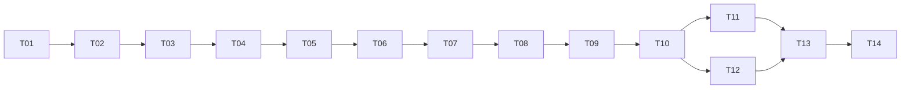

# RetailMind Implementation Plan

## 1. Delivery approach

Deliver one working analyst workflow in small stages: trustworthy purchase data, simple segments and product lists, measured personalization, then the dashboard and delivery checks.

- Planning estimate: **60–72 hours across 6 working weeks**, plus one buffer week.
- Capacity assumption: 10–12 hours per week; re-estimate after the first data audit.
- Weeks are relative to the implementation start. No calendar launch date is committed.
- Task status lives only in [todo.md](todo.md). The phase table below is a roadmap, not a second checklist.

## 2. Architecture decisions

1. Use one retail dataset for both segmentation and recommendations.
2. Compare simple RFM and popularity baselines before adding learned models.
3. Use chronological cutoffs and freeze choices before final-test assessment.
4. Share one Python service between CLI and dashboard.
5. Build a local CPU-first prototype. API and cloud deployment are optional extensions.
6. Choose a baseline when personalization or learned segmentation fails its declared gate.

Rationale and changes are recorded in [the decision log](../docs/08_DECISIONS_LOG.md).

## 3. Phases and milestones

| Phase | Relative week | Tasks | Deliverable | Exit condition |
|---|---|---|---|---|
| 1. Data foundation | W1 | T01–T03 | Locked environment, official source and cleaning audit | Schema and cleaning fixtures pass; source provenance recorded |
| 2. Baseline workflow | W2 | T04–T06 | RFM profiles, segment comparison and popularity recommendations | Time invariants pass; baseline customer/product list is usable |
| 3. Personalization and evaluation | W3–W4 | T07–T09 | CF comparison, frozen choice and final-test report | Full-catalog evaluation, confidence intervals and cohort accounting complete |
| 4. User workflow | W4–W5 | T10–T12 | Shared service, dashboard and batch diagnostics | Customer lookup, fallback, exports and diagnostics work locally |
| 5. Delivery proof | W6 | T13–T14 | Container, CI, reproducibility evidence and model card | Mandatory PRD requirements have evidence |
| Buffer | W7 | Only unfinished scoped work | Dependency or integration fixes | No automatic expansion of scope |

## 4. Dependency order

T11 and T12 are independently implementable after the service contract is verified. No subagents or concurrent edits are required. Shared contract or config changes remain sequential.

## 5. Task index

| ID | Outcome | Estimated effort |
|---|---|---|
| T01 | Reproducible local environment and package scaffold | 3–4 h |
| T02 | Official source acquired with provenance | 2–3 h |
| T03 | Cleaning contract and purchase audit | 5–6 h |
| T04 | Time-safe RFM snapshots | 4–5 h |
| T05 | Measured segment comparison and descriptions | 5–6 h |
| T06 | Global and segment popularity baseline | 3–4 h |
| T07 | Sparse item CF with fallback | 5–6 h |
| T08 | Validation evaluation and frozen choices | 5–6 h |
| T09 | Locked final-test refit and report | 3–4 h |
| T10 | Shared CLI/service contract and trusted bundle loader | 4–5 h |
| T11 | Analyst dashboard and exports | 6–7 h |
| T12 | Batch diagnostic report | 2–3 h |
| T13 | Container, CI configuration and reproducibility check | 4–5 h |
| T14 | Final validation and portfolio evidence | 3–4 h |

The detailed estimates sum to **54–68 hours**. The overall 60–72-hour estimate includes coordination and review. Each task may span small work sessions. Split a task further if its implementation requires more than five hand-edited code/config files or cannot be verified in a bounded slice. Generated reports and the routine status/log update are outside that file-count guideline.

## 6. Checkpoints

1. **After T03:** source and cleaning rules are trustworthy. No model tuning starts before this checkpoint.
2. **After T06:** the simple end-to-end baseline works and every fitted value is time-safe.
3. **After T08:** validation comparison and selection are frozen. Test labels remain untouched by model selection.
4. **After T11–T12:** customer workflow and diagnostics work using the same verified service.
5. **After T14:** evidence, limitations and run instructions support the delivered behavior.

## 7. Risk register

| Risk | Impact | Mitigation / trigger |
|---|---|---|
| Future transactions leak into RFM, popularity or product labels | High | Prefix-only construction; future-row invariance tests for every fitted component |
| Missing IDs, cancellations, duplicates or admin codes distort profiles | High | Deterministic cleaning, reconciled exclusions and prefix-only audit before modeling |
| Sparse purchase history makes CF weaker than popularity | Medium | Predeclared baseline fallback; keep evaluation results and disclose low personalization coverage |
| Cluster geometry produces unstable or tiny groups | Medium | Fixed seed diagnostics, size/stability gates and rule-based fallback |
| November/December seasonality dominates a single holdout | Medium | State period limitation; earlier rolling-cutoff checks are optional validation-only extensions, never test tuning |
| Wholesale buyers dominate monetary value | Medium | Log1p features, segment size diagnostics and training-prefix sensitivity report |
| Historical catalog is mistaken for live inventory | Medium | Display historical cutoff and activity proxy; no availability promise |
| Large dense similarity matrix exceeds local memory | Medium | CSR interactions, blocked computation and top-N retention; record memory |
| Docker is unavailable locally | Medium | Discover in T01; complete Python workflow first and report container verification as unresolved |
| Scope expands into API, cloud or neural modeling | High | Keep extensions outside MVP; update PRD before accepting scope changes |
| Metrics are reported as causal business gains | High | Separate offline ranking evidence from an unperformed campaign experiment |
| Available time differs from the planning estimate | Medium | Re-plan after data audit; defer Should diagnostics before reducing Must correctness checks |

## 8. Roles and working cadence

| Role | Responsibility |
|---|---|
| Project manager | Keep scope, dependency order, risks and realistic estimates current |
| Data scientist | Explain data quality, segments, model comparisons and uncertainty |
| ML engineer | Maintain shared pipelines, reproducible artifacts, tests and serving parity |
| Reviewer | Challenge leakage, denominator choices, unsupported labels and claimed results |

One person may perform these roles. At each session end update progress and the next task. At each phase boundary review scope and risk before continuing. An authorized start/continue request permits routine local work; no repeated confirmation is required for unchanged documented tasks.

## 9. Definition of done

- Task-specific acceptance criteria and verification pass.
- No unexplained difference between training, CLI and dashboard behavior.
- Relevant reports identify their inputs, cutoff, config and artifact version.
- Tests cover meaningful edge cases; documentation describes the actual behavior.
- Task status and progress evidence are updated.
- All Must requirements have evidence for project completion. A failed aspirational model target is disclosed and does not justify fabricated results.

